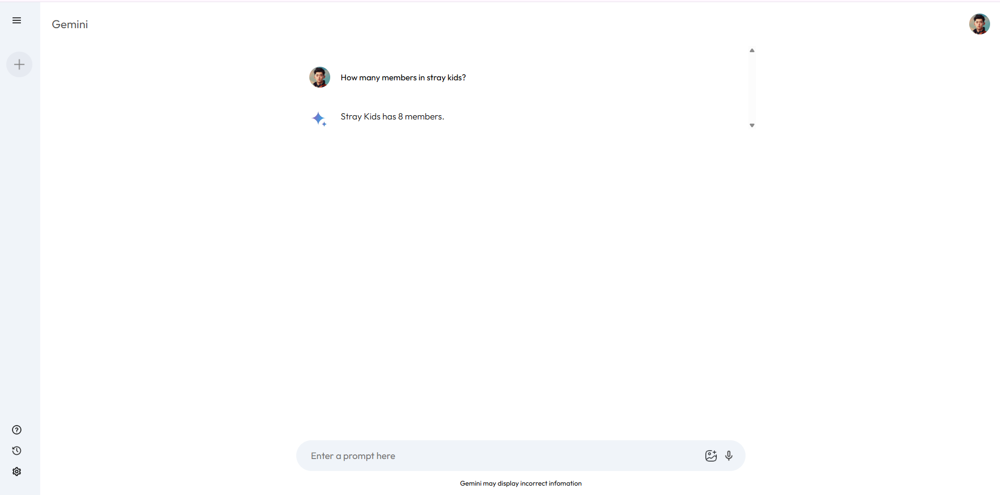

# Gemini Clone

This project is a **front-end clone** of the Gemini AI interface by Google, built using only **HTML**, **CSS**, and **JavaScript**. It simulates how users interact with a chatbot, allowing them to type prompts and see generated responses in a clean, Gemini-style layout. While it does not include real AI responses, the design mimics the experience of chatting with an AI.

---

## 🎯 Project Purpose

The main goal of this project is to:

- Practice front-end development using **vanilla HTML, CSS, and JS**
- Recreate a modern, minimalistic UI similar to Google's Gemini
- Understand layout, styling, and DOM manipulation
- Prepare for integrating with real AI APIs in the future (optional)

This project is useful for students and beginners who want to learn UI/UX design, responsive layout, and front-end interactions **without relying on frameworks**.

---

## ✨ Key Features

- 🧠 Gemini-style layout and dark theme  
- 📩 Text input box for user prompts  
- 🖥️ Simulated response area to mimic AI replies  
- 🧱 Clean, modular structure using separate HTML, CSS, and JS files  
- 📱 Responsive design for desktop and mobile

---

## 📸 Screenshots

>


---

## 🔧 Tech Stack

- HTML5 for structure  
- CSS3 for styling  
- JavaScript (ES6+) for interaction and DOM handling  
- No libraries or frameworks — 100% custom

---

## 🚀 How to Use

### 1. Clone the repository:

```bash
git clone https://github.com/mai12122/gemini_clone.git
cd gemini_clone


